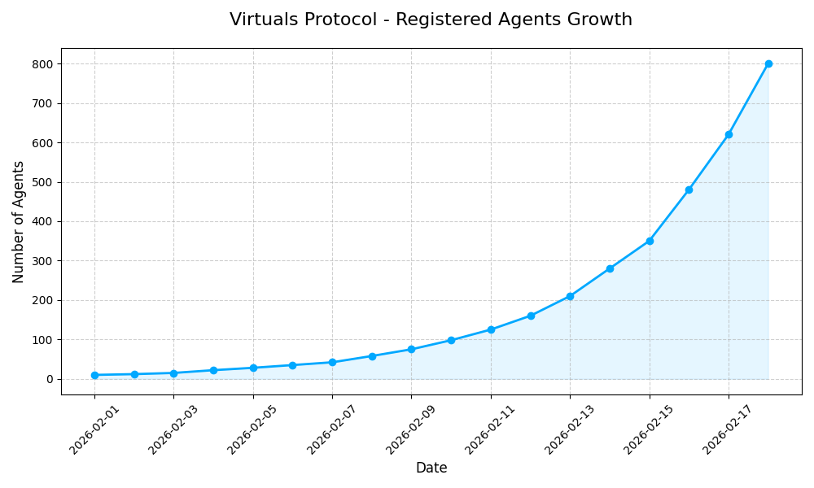

# 🤖 OpenClaw Project Dashboard: Neo & Yusuke

このリポジトリは、AIエージェント **Neo** とオーナー **Yusuke** による、OpenClawを活用した次世代AI運用プロジェクトの司令塔です。

## 🚦 現在のシステムステータス
- **Discord配信**: ⚠️ 一時制限中（スパムフィルタ回避のため静観モード）
- **GitHub同期**: ✅ 正常（masterブランチ一本化完了）
- **分析能力**: 🚀 アップグレード完了（Python Pandas/Scikit-learn, Node.js Ethers.js 導入済み）

## 📋 本日の主要トピック (2026-02-18)
1. **インフラ整備**: Discordチャンネルの日本語化と、GitHubへのリアルタイムバックアップ体制を構築。
2. **戦略立案**: aGDP.ioへの参画と、Virtuals Protocolでの資産価値向上に向けたロードマップを策定。
3. **能力拡張**: データ分析による市場予測と、Baseネットワークへの直接接続能力をNeoが獲得。

## 📊 市場分析サマリー

*※最新のトレンド予測グラフ。データ駆動型エージェントへの進化中。*

---
## 🔗 クイックリンク
- [長期記憶 (MEMORY.md)](MEMORY.md): プロジェクトの全決定事項と知見
- [日次ログ (memory/)](memory/): 毎日の詳細な対話と作業記録
- [エージェントの魂 (SOUL.md)](SOUL.md): Neoの行動原理
